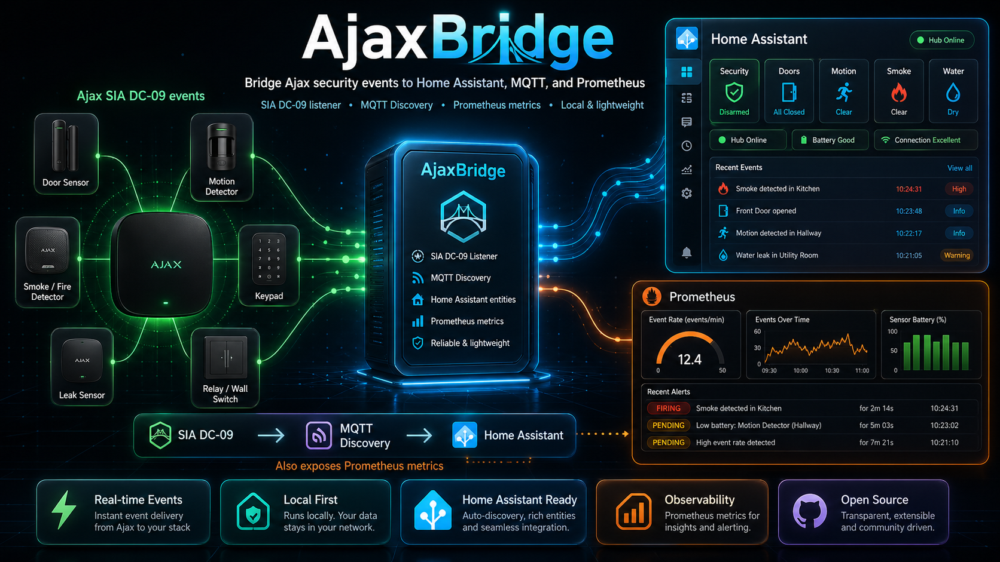

# AjaxBridge

Receives Ajax security hub SIA DC-09 events, keeps the current alarm state in memory, and exposes Prometheus metrics on `/metrics`.

*If i ever get access to API will update to also have all sensors info, automation via Home Assistant etc.

<p style="text-align: center">

</p>

It is a small bridge made of:

- SIA DC-09 TCP receiver
- Ajax/SIA event normalizer
- in-memory state engine
- Prometheus exporter
- optional raw SIA forwarding to other receivers (Home Assistant, CMS, etc.)
- JSON device catalog for Grafana labels

No database is required. Event history and state are kept in memory and reset on restart. The device catalog is stored in `data/devices.json` relative to this directory.

## Build Locally

Copy this whole directory wherever you want, for example `./ajax-bridge`, then build from inside it:

```powershell
docker build -t ajax-bridge .
```

## Docker Compose

```powershell
services:
  ajaxbridge:
    image: rcooler/ajax-bridge:latest
    container_name: ajaxbridge
    restart: unless-stopped
    ports:
      - "8080:8080"
      - "8099:8099"
    environment:
      AJAXBRIDGE_HTTP_ADDR: ":8080"
      AJAXBRIDGE_SIA_ADDR: ":8099"
      AJAXBRIDGE_ACCOUNT: "0001"
      AJAXBRIDGE_LOG_LEVEL: "info"
      AJAXBRIDGE_LOG_PRETTY: "false"
      AJAXBRIDGE_STRICT_CRC: "true"
      AJAXBRIDGE_PING_INTERVAL: "60s"
      AJAXBRIDGE_OFFLINE_GRACE: "180s"
      AJAXBRIDGE_READ_TIMEOUT: "120s"
      AJAXBRIDGE_FORWARD_TIMEOUT: "5s"
      AJAXBRIDGE_FORWARD_REQUIRE_ACK: "false"
      AJAXBRIDGE_DEVICES_PATH: "/data/devices.json"

      # Optional: AES key configured in Ajax SIA monitoring settings.
      # AJAXBRIDGE_ENCRYPTION_KEY: "REPLACE_WITH_32_HEX_AES_KEY"

      # Optional: publish Home Assistant MQTT discovery and retained state.
      # AJAXBRIDGE_MQTT_BROKER: "tcp://homeassistant.local:1883"
      # AJAXBRIDGE_MQTT_USERNAME: "mqtt-user"
      # AJAXBRIDGE_MQTT_PASSWORD: "mqtt-password"
      # AJAXBRIDGE_MQTT_TOPIC_PREFIX: "ajaxbridge"
      # AJAXBRIDGE_MQTT_DISCOVERY: "true"

      # Optional: forward raw SIA frames to Home Assistant's SIA integration.
      # Use an IP/hostname reachable from inside this container.
      # AJAXBRIDGE_FORWARD_ADDR: "home-assistant.example:12345,cms.example:7700"
    volumes:
      # The app creates/updates /data/devices.json as new Ajax zones are seen.
      - ./data:/data
    healthcheck:
      test: ["/app/ajaxbridge", "healthcheck"]
      interval: 30s
      timeout: 3s
      start_period: 10s
      retries: 3

```

Published images:

- `rcooler/ajax-bridge:latest`
- `rcooler/ajax-bridge:X.Y.Z`
- `rcooler/ajax-bridge:X.Y`
- `rcooler/ajax-bridge:X`
- `rcooler/ajax2prometheus:latest`
- `rcooler/ajax2prometheus:X.Y.Z`
- `rcooler/ajax2prometheus:X.Y`
- `rcooler/ajax2prometheus:X`

Git tags matching `v*` trigger `.github/workflows/release.yml`, which runs GoReleaser and pushes a multi-arch Docker image for `linux/amd64` and `linux/arm64` to Docker Hub.

GitHub releases upload only:

- the source archive generated by GoReleaser
- `ha-cards/dist/ajax-security-dashboard.js`

Required GitHub Actions secrets:

- `DOCKERHUB_USERNAME`
- `DOCKERHUB_TOKEN`

Local dry-run:

```powershell
cd ..
go run github.com/goreleaser/goreleaser/v2@latest release --snapshot --clean
```

## Ajax Setup

Configure the Ajax hub monitoring station connection:

- Protocol: `SIA DC-09`
- Transport: `TCP`
- Receiver address: host running this service
- Receiver port: `8099` by default
- Account/object number: same value as `AJAXBRIDGE_ACCOUNT`
- Encryption: optional AES key matching `AJAXBRIDGE_ENCRYPTION_KEY`
- Connection mode: connect on demand or constant connection

## Configuration

| Variable | Default | Description |
| --- | --- | --- |
| `AJAXBRIDGE_SIA_ADDR` | `:8099` | SIA TCP listen address |
| `AJAXBRIDGE_HTTP_ADDR` | `:8080` | HTTP listen address |
| `AJAXBRIDGE_ACCOUNT` | empty | Expected Ajax account/object number |
| `AJAXBRIDGE_ENCRYPTION_KEY` | empty | Optional SIA AES key |
| `AJAXBRIDGE_FORWARD_ADDR` | empty | Comma-separated upstream SIA receivers |
| `AJAXBRIDGE_FORWARD_TIMEOUT` | `5s` | Upstream forwarding timeout |
| `AJAXBRIDGE_FORWARD_REQUIRE_ACK` | `false` | Return NAK to Ajax if an upstream receiver does not ACK |
| `AJAXBRIDGE_MQTT_BROKER` | empty | Optional MQTT broker URL, for example `tcp://homeassistant.local:1883` |
| `AJAXBRIDGE_MQTT_USERNAME` | empty | MQTT username |
| `AJAXBRIDGE_MQTT_PASSWORD` | empty | MQTT password |
| `AJAXBRIDGE_MQTT_CLIENT_ID` | `ajaxbridge` | MQTT client ID |
| `AJAXBRIDGE_MQTT_TOPIC_PREFIX` | `ajaxbridge` | MQTT state topic prefix |
| `AJAXBRIDGE_MQTT_DISCOVERY` | `true` | Publish Home Assistant MQTT discovery configs when MQTT is enabled |
| `AJAXBRIDGE_MQTT_DISCOVERY_PREFIX` | `homeassistant` | Home Assistant MQTT discovery prefix |
| `AJAXBRIDGE_MQTT_TIMEOUT` | `5s` | MQTT connect and publish timeout |
| `AJAXBRIDGE_MQTT_RETAIN` | `true` | Retain MQTT state messages |
| `AJAXBRIDGE_DEVICES_PATH` | `data/devices.json` | Device catalog path |
| `AJAXBRIDGE_PING_INTERVAL` | `60s` | Expected Ajax monitoring station ping interval |
| `AJAXBRIDGE_OFFLINE_GRACE` | `180s` | Grace period before marking account offline |
| `AJAXBRIDGE_READ_TIMEOUT` | `120s` | SIA connection read timeout |
| `AJAXBRIDGE_STRICT_CRC` | `true` | Validate SIA DC-09 CRC/length |
| `AJAXBRIDGE_LOG_LEVEL` | `info` | `debug`, `info`, `warn`, or `error` |
| `AJAXBRIDGE_LOG_PRETTY` | `false` | Human-readable console logs |

Legacy `AJAX2PROM_*` environment variables are still accepted as compatibility aliases.

## HTTP Endpoints

- `GET /metrics` Prometheus metrics
- `GET /healthz` health check
- `GET /readyz` readiness check
- `GET /state` current account and zone state
- `GET /events?limit=100` latest in-memory events
- `GET /devices` device catalog

Container images ship with a built-in Docker `HEALTHCHECK` that runs `ajaxbridge healthcheck` against the local readiness endpoint. The command follows `AJAXBRIDGE_HTTP_ADDR`, so custom HTTP listen ports do not need a separate probe command.

## Metrics

Core metrics:

- `ajax_sia_events_total`
- `ajax_sia_parse_errors_total`
- `ajax_sia_forward_total`
- `ajax_sia_forward_duration_seconds`
- `ajax_account_online`
- `ajax_account_armed`
- `ajax_account_night_mode`
- `ajax_account_partially_armed`
- `ajax_account_alarm_active`
- `ajax_account_tamper_active`
- `ajax_account_trouble_active`
- `ajax_zone_alarm_active`
- `ajax_zone_alarm_last_event_timestamp_seconds`
- `ajax_zone_tamper_active`
- `ajax_zone_tamper_last_event_timestamp_seconds`
- `ajax_zone_trouble_active`
- `ajax_zone_last_event_timestamp_seconds`

All `ajax_zone_*` metrics include stable catalog labels where available: `account`, `partition`, `group`, `zone`, `device`, `device_name`, `room`, `device_kind`, and `device_events`. Alarm metrics also include `alarm_signal` and `alarm_action`.

## Home Assistant MQTT

Set `AJAXBRIDGE_MQTT_BROKER` to enable MQTT publishing. Home Assistant discovery is enabled by default, so each Ajax account and each device from `data/devices.json` appears as a separate Home Assistant device.

See [ha.md](./ha.md) for step-by-step Home Assistant setup and troubleshooting.

See [Home Assistant card examples](../ha-cards/EXAMPLES.md) for Lovelace card examples built around the discovered Ajax account and zone entities.

MQTT is intentionally non-blocking for SIA handling. If the MQTT broker is down or slow, Ajax ACK responses are still sent normally.

Published state topics:

```text
ajaxbridge/status
ajaxbridge/accounts/A0F80D/state
ajaxbridge/accounts/A0F80D/zones/3/state
```

Home Assistant discovery topics use the configured discovery prefix:

```text
homeassistant/binary_sensor/ajaxbridge/zone_a0f80d_3_signal_fire/config
homeassistant/sensor/ajaxbridge/zone_a0f80d_3_last_event_name/config
```

Each zone/device publishes one retained JSON state payload with current status and signal states:

```json
{
  "account": "A0F80D",
  "zone": "3",
  "device_name": "Hall fire detector",
  "room": "Hall",
  "kind": "FireProtect",
  "device_events": ["fire", "smoke", "temperature", "tamper", "battery", "connectivity"],
  "alarm_active": false,
  "tamper_active": false,
  "trouble_active": false,
  "signal_active": {
    "fire": false,
    "smoke": false,
    "temperature": false,
    "tamper": false,
    "battery": false,
    "connectivity": false
  },
  "last_event_code": "BR",
  "last_event_name": "Burglary alarm restored",
  "last_signal": "burglary",
  "last_event_at": "2026-04-20T12:00:00Z"
}
```

For every zone, discovery creates:

- `binary_sensor` entities for `alarm_active`, `tamper_active`, and `trouble_active`
- one `binary_sensor` for every value in the device `events` list, such as `fire`, `smoke`, `battery`, `connectivity`, `power`, `bypass`, or `water_leak`
- `sensor` entities for last event name, code, signal, event time, alarm signal, and alarm action

For every account, discovery creates:

- `binary_sensor` entities for online, armed, night mode, partially armed, alarm, tamper, and trouble
- `sensor` entities for mode, last event, last signal, last event time, and last ping time

## Device Catalog

The app creates `data/devices.json` automatically when it sees new zones. Edit this file to add human-readable names for Grafana.

Example:

```json
[
  {
    "account": "0001",
    "zone": "7",
    "name": "Hall smoke detector",
    "room": "Hall",
    "kind": "fireprotect",
    "events": ["smoke", "temperature", "tamper"]
  }
]
```

For Ajax SIA-DCS payloads like `Nri1/BA007`:

- `ri1` is the SIA area/partition
- `BA` is the event code
- `007` is the zone/device number to map in `data/devices.json`

In the Ajax app, the device number is shown in the device details at the very bottom of the screen.

Devices listed in `data/devices.json` are exported to `/state` and `/metrics` immediately after startup, even before the first event arrives for that device. Inactive device metrics start at `0` with a last-event timestamp of `0`.

The `events` field is a Grafana/Prometheus label, not an Ajax setting. The app also updates it automatically when real events arrive, but you can prefill it with the normalized signal labels below so dashboards do not need to wait for alarms or faults.

Common event labels supported by this app:

| Ajax device kind | Suggested `events` values |
| --- | --- |
| Hub | `supervision`, `connectivity`, `battery`, `power`, `tamper`, `interference`, `configuration`, `firmware` |
| User or mobile app | `arming`, `night_mode`, `duress`, `panic` |
| KeyPad, KeyPad Plus, KeyPad TouchScreen | `arming`, `night_mode`, `duress`, `access`, `tamper`, `battery`, `connectivity`, `bypass`, `tamper_bypass` |
| SpaceControl, control buttons, key fobs | `arming`, `night_mode`, `panic`, `duress`, `battery`, `connectivity`, `bypass` |
| Button, DoubleButton, panic/medical buttons | `panic`, `medical`, `emergency`, `tamper`, `battery`, `connectivity`, `bypass` |
| MotionProtect, MotionCam, DoorProtect, GlassProtect, CombiProtect, curtain/opening/motion detectors | `burglary`, `tamper`, `battery`, `connectivity`, `bypass`, `tamper_bypass`, `accelerometer` |
| MotionCam and detectors with photo verification | `burglary`, `tamper`, `battery`, `connectivity`, `bypass`, `tamper_bypass`, `accelerometer` |
| FireProtect, FireProtect Plus, FireProtect 2 | `fire`, `smoke`, `temperature`, `gas_or_co`, `co`, `fire_detector`, `tamper`, `battery`, `connectivity`, `bypass`, `tamper_bypass` |
| LeaksProtect | `water_leak`, `battery`, `connectivity`, `bypass`, `tamper_bypass` |
| Transmitter, MultiTransmitter, wired input modules | `burglary`, `fire`, `medical`, `panic`, `emergency`, `gas_or_co`, `water_leak`, `temperature`, `tamper`, `duress`, `accelerometer`, `hardware`, `arming`, `night_mode`, `battery`, `connectivity`, `power`, `bypass`, `tamper_bypass` |
| HomeSiren, StreetSiren, sirens | `tamper`, `battery`, `connectivity`, `power`, `bypass`, `tamper_bypass` |
| Relay, WallSwitch, Socket, automation modules | `power`, `connectivity`, `hardware`, `firmware` |
| ReX, ReX 2, range extenders | `connectivity`, `power`, `battery`, `tamper`, `firmware` |

Raw labels that may be auto-discovered from received SIA events are: `access`, `accelerometer`, `arming`, `battery`, `burglary`, `bypass`, `co`, `configuration`, `connectivity`, `duress`, `emergency`, `fire`, `fire_detector`, `firmware`, `gas`, `gas_or_co`, `hardware`, `interference`, `medical`, `night_mode`, `panic`, `power`, `smoke`, `supervision`, `tamper`, `tamper_bypass`, `temperature`, and `water_leak`.

Ajax documents direct SIA DC-09 event delivery and the SIA-DCS/ADM-CID payload shape in its support docs:

- <https://support.ajax.systems/en/how-to-use-sia-for-cms-connection/>
- <https://support.ajax.systems/en/manuals/cloud-signaling/>

## Logging

Default logs are JSON at `info` level. Accepted frames log a normalized event object without raw SIA frame data.

Use debug logs only while troubleshooting:

```powershell
--log-level debug --log-pretty
```

Debug logs include raw SIA frames, account numbers, internal addresses, timestamps, zones, and payloads. Do not publish debug logs.

## Forwarding

Set `AJAXBRIDGE_FORWARD_ADDR` to relay valid raw SIA frames to other receivers:

```text
AJAXBRIDGE_FORWARD_ADDR=home-assistant.example:12345,cms.example:7700
```

By default, forwarding errors are logged and exported as metrics but do not prevent ACK to Ajax. Set `AJAXBRIDGE_FORWARD_REQUIRE_ACK=true` if Ajax should receive NAK when any upstream receiver fails to ACK.
